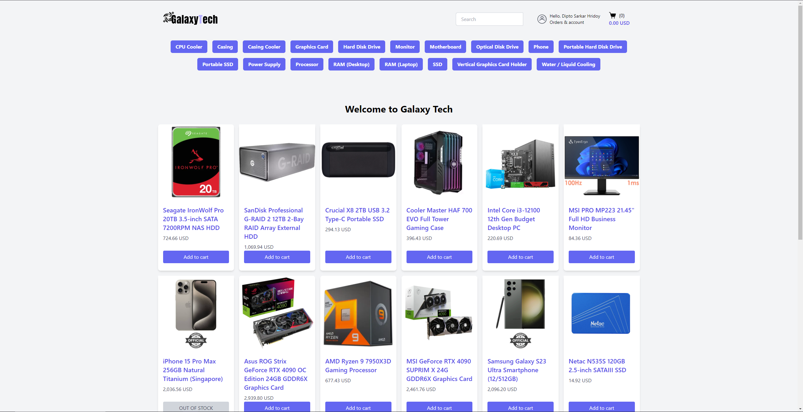
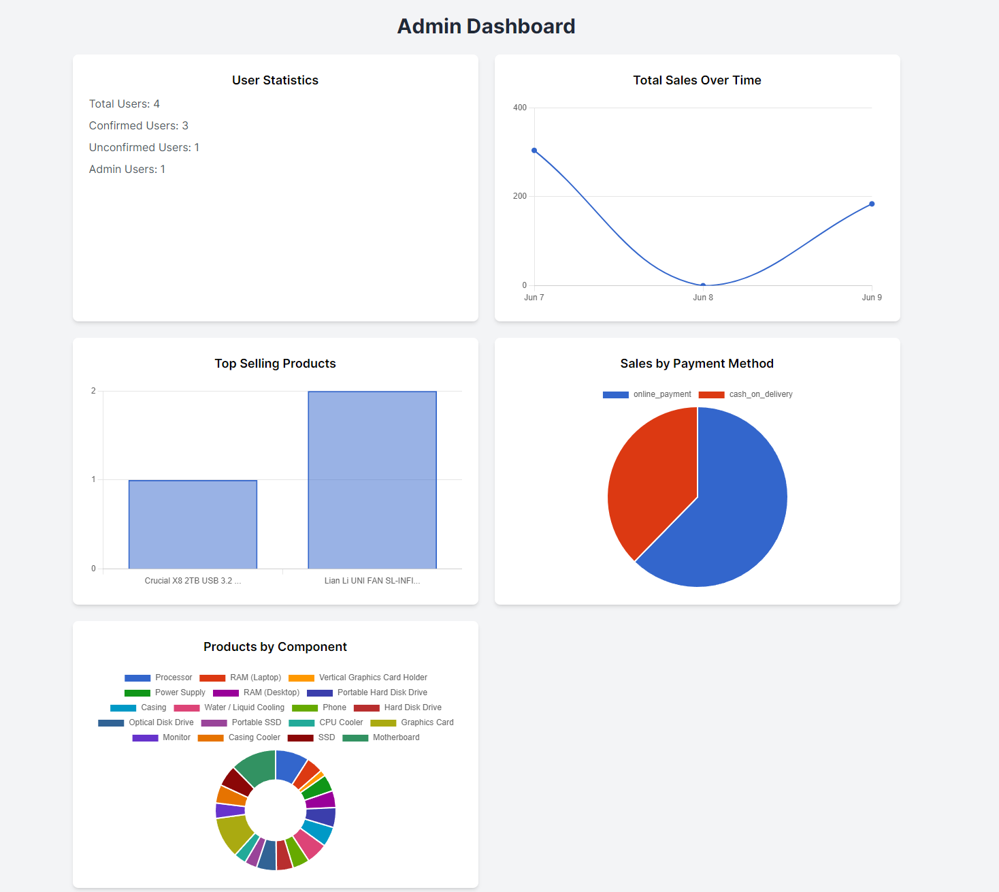

# Galaxy Tech

## Introduction

Welcome to Galaxy Tech, an e-commerce platform dedicated to selling PC parts, components and phones. 
It offers a wide range of products from CPUs and GPUs to RAM and SSDs. Whether you're 
building a PC from scratch, upgrading a current setup, or just looking for specific components, Galaxy 
Tech has you covered. The platform features detailed product descriptions and a search 
engine to help you find exactly what you need.

## Live Demo

You can see a live version of the app **[here](https://galaxy-tech.onrender.com)**.
Please note that the app is hosted on a free tier and may take a moment to load if it has been inactive.

To test the application with an account that has admin privileges, use the following credentials:

**Email:** testadmin@gmail.com
**Password:** 123456

Please note that the test admin account does not have permission to delete products.

## Features

- **User Authentication:** Implemented with Devise gem. Users can sign up, log in, log out, confirm account, 
reset password, sign in with google. Passwords are securely hashed and stored.

- **Product Catalog:** A wide range of PC components are listed. Each product has a detailed description, price, 
, image, rating and reviews.

- **Ratings and Reviews:** After delivery is complete, user can provide rating and review of the received product. User
can also edit their ratings and reviews. 

- **Search and Filter:** Users can search for products by name or filter by categories such as CPUs, GPUs, RAM, 
and SSDs.

- **Shopping Cart:** Users can add products to a shopping cart and adjust quantities as needed.

- **Checkout and Payment:** Integrated with Stripe for payment processing. Users can enter their payment details and 
complete their purchase.

- **Order History:** Users can view their past orders, including the purchased items, quantities, and total cost.

- **Email Service:** Through sendgrid email service, users are able to confirm account and reset password. Upon signing
up, user will receive welcome email and their orders and payment confirmation emails.

[//]: # (- **Product Reviews:** Users can leave reviews for products they've purchased, including a rating and comments.)

- **Admin Panel:** Admin users can add, edit, or remove products.

## Technology Used

- Ruby on Rails
- Hotwire
- PostgreSQL
- Devise
- Active Storage
- TailwindCSS
- Cloudinary
- Action Mail
- Stripe

## Screenshots

## Getting Started

These instructions will get you a copy of the project up and running on your local machine for development and testing purposes.

### Prerequisites

You need to have Ruby and Rails installed on your machine. See [this guide](https://guides.rubyonrails.org/getting_started.html#creating-a-new-rails-project-installing-rails) for instructions on setting up Rails.

### Installing

1. Clone the repository: `git clone https://github.com/DiptoSarkar182/galaxy_tech`
2. Navigate into the project directory: `cd galaxy_tech`
3. Install the dependencies: `bundle install`
4. Set up the database: `rails db:create db:migrate`
5. Start the server: `rails server`
6. Visit `http://localhost:3000/` in your browser to access the application.

Galaxy Tech logo made by **[Fahim Haque](https://dribbble.com/Fahimsarfi)**

All product data were sourced from **[Startech](https://www.startech.com.bd/)**. Please note that this data is used for educational purposes and not for commercial use.

[Cart](https://icons8.com/icon/59997/shopping-cart), [Customer](https://icons8.com/icon/65342/customer) icon by [Icons8](https://icons8.com)

